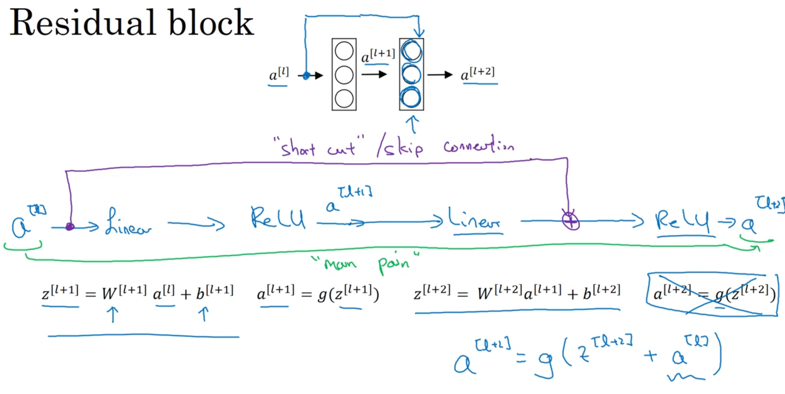
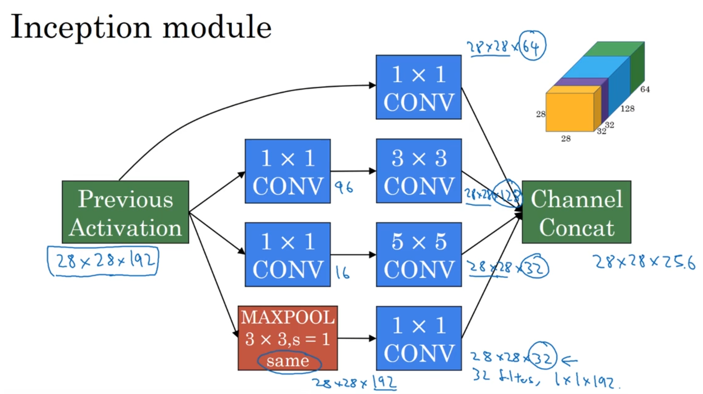

# 吴恩达深度学习第四课 学习笔记

> 三、卷积神经网络（CNN）
> （1）视频教程：学习吴恩达deeplearning.ai系列教程中第四课前两周内容。
> （2）学习目标：学习卷积神经网络的基本结构，了解常见的卷积神经网络。重点掌握卷积和池化的计算以及CNN中的反向传播算法。
> （3）动手实验：完成第四课对应的课后编程作业并撰写报告，报告主要记录实验原理（CNN模型结构、反向传播理论推导等）、实验环境、实验结果、结果分析等。

**相关链接**
[吴恩达深度学习第四课](https://www.bilibili.com/video/BV1F4411y7o7/)
[作业链接1](https://zhuanlan.zhihu.com/p/95510114)
[作业链接2](https://zhuanlan.zhihu.com/p/354386182)

## week-1

### 1.1 卷积的引入

对于图片信息，如果将其展平，作为特征输入，有很多特征，训练效率低

### 1.2 & 1.3 卷积用于边缘检测

可以将卷积核作为w参数来训练

### 1.4 Padding

n\*n的矩阵与f\*f的卷积核卷积后，得到的矩阵大小为  
$$
(n-f+1) \times (n-f+1)
$$  
即矩阵会缩小，图像边界信息丢失

将n\*n的矩阵扩展(填充0)，四周扩展p像素(p: padding值)，得到(n+2p)\*(n+2p)的矩阵  
卷积后的矩阵大小为  
$$
(n+2p-f+1) \times (n+2p-f+1)
$$

valid: 不扩展进行卷积(p = 0)
same: 扩展后进行卷积，卷积后矩阵与原矩阵大小相同 ( $p = \frac{f - 1}{2}$ ) f常设为奇数

### 1.5 卷积步长 stride

s: 卷积步长stride  
p: padding  
n\*n的矩阵与f\*f的卷积核卷积后，得到的矩阵大小为
$$
\left \lfloor \frac{n + 2p - f}{s} + 1 \right \rfloor \times
\left \lfloor \frac{n + 2p - f}{s} + 1 \right \rfloor
$$
(卷积核超过原图像边界后不进行卷积，故向下取整)

### 1.6 三维卷积

对于rgb图像，有三层(height\*width\*channel)  
如果图像的channel和卷积核的一样，卷积结果为单层

例如:  
$(6 \times 6 \times 3)$ 的矩阵和 $(3 \times 3 \times 3)$ 的卷积核卷积
得到 $(4 \times 4)$ 的矩阵

如果使用多个卷积核进行卷积(得到不同方向的边界信息)
可以将图像与各个卷积核卷积的结果堆叠起来，得到多通道的结果

$$
(n \times n \times n_c) \otimes (f \times f \times n_c) =
((n - f + 1) \times (n - f + 1) \times {n_c}')
$$

${n_c}'$: 使用的卷积核数(卷积结果的通道数)(检测的特征数)

### 1.7 & 1.8 单层卷积神经网络


<!--  -->

这样，w参数即所有卷积核的大小，小于将图像展平后的参数

**卷积层的矩阵维度**
$f^{[l]}$ : 卷积核大小
$p^{[l]}$ : padding值
$s^{[l]}$ : 卷积步长stride
$n_{c}^{[l]}$ : 卷积核数量

输入矩阵大小为
$$
n_{H}^{[l-1]} \times n_{W}^{[l-1]} \times n_{c}^{[l-1]}
$$

卷积核(滤波器filter)大小为
$$
f^{[l]} \times f^{[l]} \times n_{c}^{[l-1]}
$$

则输出矩阵大小  
$$
n_{H}^{[l]} \times n_{W}^{[l]} \times n_{c}^{[l]} \\
n_{H}^{[l]} =
\left \lfloor
\frac{n_{H}^{[l-1]} + 2p^{[l]} - f^{[l]}}{s^{[l]}} + 1
\right \rfloor , \quad
n_{W}^{[l]} =
\left \lfloor
\frac{n_{W}^{[l-1]} + 2p^{[l]} - f^{[l]}}{s^{[l]}} + 1
\right \rfloor
$$

经过激活函数后( $a^{[l]}$ )大小
$$
n_{H}^{[l]} \times n_{W}^{[l]} \times n_{c}^{[l]}
$$
$A^{[l]}$ 大小
$$
m \times n_{H}^{[l]} \times n_{W}^{[l]} \times n_{c}^{[l]}
$$

权重参数W矩阵大小
$$
f^{[l]} \times f^{[l]} \times n_{c}^{[l-1]} \times n_{c}^{[l]}
$$

### 1.9 池化层

卷积神经网络中层的类型

- 卷积层 CONV (convolution)
- 池化层 POOL (pooling)
- 全连接层 FC (fully connected)

池化中**没有参数需要学习**  

**最大池化**
滤波器为取最大值  
滤波器的f，卷积的步长s，也是超参数  
最大池化只在一层(一个通道)上进行，每层(每通道)单独计算，最大池化后层数(通道数)不变  
池化后，高度h和宽度w会减小

**平均池化**
滤波器为取平均值  
不常用，在很深的网络可能会用  

**超参数**
滤波器的f  
卷积的步长s  
选择最大池化还是平均池化  
(padding值)很少用 (p=0)  

输入矩阵大小为
$$
n_{H} \times n_{W} \times n_{c}
$$
池化后输出矩阵大小为
$$
\left \lfloor \frac{n_{H} - f}{s} + 1 \right \rfloor \times
\left \lfloor \frac{n_{W} - f}{s} + 1 \right \rfloor \times
n_{c}
$$

通常卷积层后跟着池化层，这两层合在一起算作神经网络的一层(只计算有权重的层)

### 1.10 全连接层

深层节点的a展平后，进行标准的神经网络计算  
即标准的神经网络层，仅对特征向量计算  

随着网络深度加深， $n_H$ 和 $n_W$ 会减少，但通道数 $n_c$ 会增加，a的大小会减小  
随后进入全连接层

对于卷积神经网络，卷积层的参数较少，全连接层的参数较多

### 1.11 使用卷积神经网络的原因

**参数共享**  (卷积神经网络参数少的原因)  
即如果卷积核检测适用于一个区域，对其他区域也适用

**连接稀疏**  (卷积神经网络参数少的原因)  
z的值仅与卷积核大小范围的上一层的值有关  
即卷积核大小决定了z需要参考上一层的多少个值，卷积核size较小
故上下两层连接稀疏，防止了过拟合

**卷积神经网络善于抓住平移不变性**
卷积核在每次卷积的过程中都相当于移动了

**反向传播**
$$
dA += \sum _{h=0} ^{n_H} \sum_{w=0} ^{n_W} W_c \times dZ_{hw} \\
dW_c  += \sum _{h=0} ^{n_H} \sum_{w=0} ^ {n_W} a_{slice} \times dZ_{hw} \\
db = \sum_h \sum_w dZ_{hw}
$$

```python
da_perv_pad[vert_start:vert_end,horiz_start:horiz_end,:] += W[:,:,:,c] * dZ[i,h,w,c]
dW[:,:,:,c] += a_slice * dZ[i, h, w, c]
db[:,:,:,c] += dZ[ i, h, w, c]
```

## week-2

### 2.1 神经网络示例

经典神经网络

- LeNet-5
- AlexNet
- VGG

ResNet 残差网络

inception网络

### 2.2 经典神经网络

神经网络**LeNet-5**

- conv -> pool -> activate -> conv -> pool -> activate -> FC -> FC -> output
- 使用sigmoid作为激活函数

神经网络**AlexNet**

- 参数比LeNet-5多  
- 激活函数为ReLU  
    表现比LeNet-5好  
- 可以在2个gpu上运算
- ~~有**局部响应归一化层(LRN层)** Local Response Normalization~~  
    即对同一个w和h，将所有通道归一化，但不一定起作用

神经网络**VGG-16**

- 超参数少，专注于构建卷积层的神经网络  
    conv: f=3\*3,s=1,p=1  
    max-pool: f=2\*2,s=2,p=0  
- 大致结构
    -> [conv64] \* 2 -> pool  
    -> [conv128] \* 2 -> pool  
    -> [conv256] \* 3 -> pool  
    -> [conv512] \* 3 -> pool  
    -> [conv512] \* 3 -> pool  
    -> FC -> FC -> softmax

### 2.3 & 2.4 残差网络

很深的网络由于梯度消失和梯度爆炸的问题难以训练

使用跳远连接构建网络**ResNet**
某层的激活迅速反应给另外一层，甚至是深层

ResNet由**残差块**(residual block)构成


<!--  -->

将浅层的a 与深层线性后的z 线性相加 再激活
原始的网路 训练错误 随着层数增多 先减后增
由残差块的网络 训练错误 随着层数增多 一直下降

**残差网络有用的原因**
极端情况，如果线性后的z使用了正则化，其值较小，而浅层的a值较大，相当于a再次激活进入下层，网络层数减少，便于训练
实现跳远链接需要保证维度一致，若不一致，需要将一个参数矩阵与a相乘，以保证维度一致

### 2.5 网络中1\*1的卷积核

矩阵与1\*1的卷积核卷积 相当于乘一个数

对于多个通道的矩阵 与多个通道的1\*1的filter卷积  
相当于对每个输入矩阵w和h上每个通道的值进行了一次全连接
即 network in network

可以用1\*1的filter改变矩阵的通道数

减小通道数以**减小计算量**  
如果要使通道数减少，可以先将多通道的矩阵与1\*1的filter卷积降低通道数，构建瓶颈层，再与大的filter卷积

### 2.6 & 2.7 inception网络

inception层  
应用多种大小的卷积核，甚至pool(需要padding=same)
将结果在通道层叠加

inception网络不需要决定filter大小或者是否池化，让网络训练来决定需要什么参数  


<!--  -->

在隐藏层中引出FC分支，计算softmax，防止过拟合
