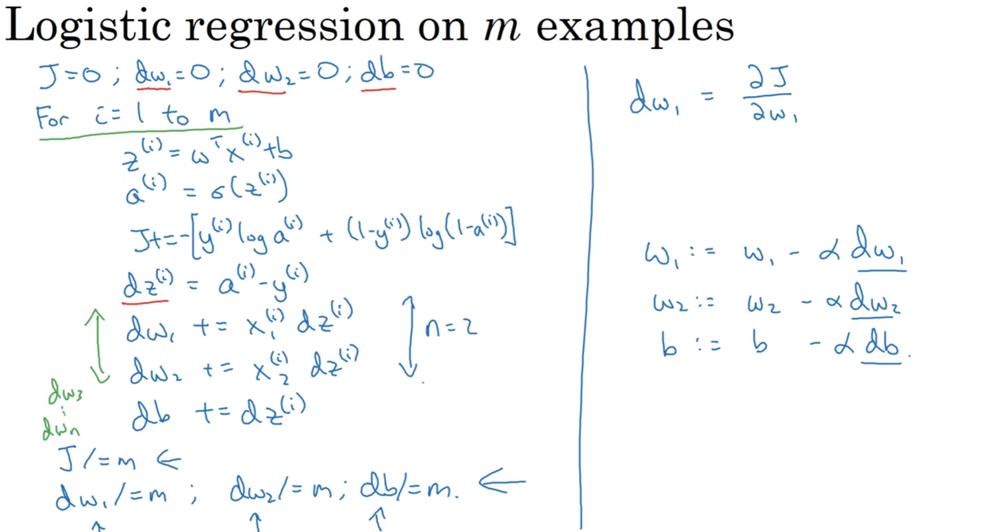
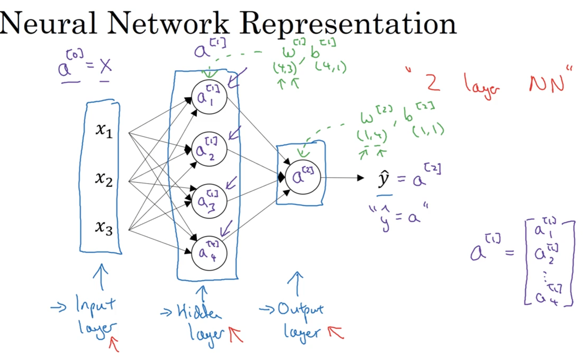
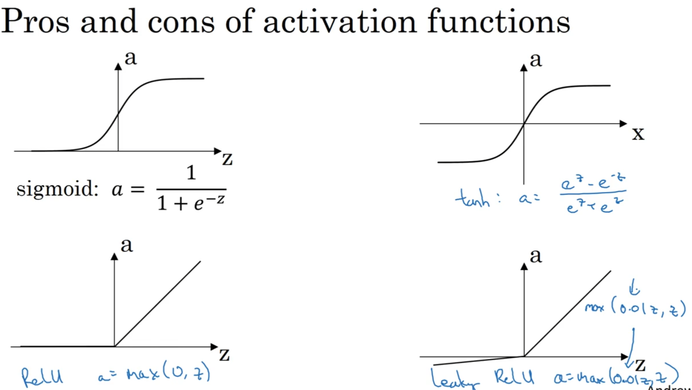

# 吴恩达深度学习第一课 学习笔记

> 一、 神经网络与深度学习
> （1）视频教程：学习吴恩达deeplearning.ai系列教程中第一课所有内容
> （2）学习目标：学习Python和numpy科学计算库的基本用法，了解人工神经网络（ANN）基本组成结构，重点掌握如何利用反向传播算法训练ANN。
> （3）动手实验：完成第一课对应的课后编程作业并撰写报告，报告主要记录实验原理（反向传播算法推导等）、实验环境、实验结果、结果分析等。

相关链接  
[吴恩达深度学习第一课](https://www.bilibili.com/video/BV164411m79z/?p=1&vd_source=4b212d2a811ccd13663cd8ae6309afc8)
[作业链接1](https://zhuanlan.zhihu.com/p/95510114)
[作业链接2](https://zhuanlan.zhihu.com/p/354386182)

## week-1

修正线性单元ReLU (rectified linear unit)
激活函数 对于正值输入 梯度为1
对于sigma函数 有梯度小的地方 梯度下降法时 学习缓慢

监督学习 (supervised learning)

标准神经网络架构 standard neural network architecture

卷积神经网络 CNN convolution neural network
二维数据 图像领域

循环神经网络 RNN recurrent neural network
一维数据 sequence data序列数据 音频等

structured data 结构化数据
数据有具体的含义

unstructured data 非结构化数据
图像 音频 文字 等

数据的规模e和网络的规模都对深度学习的性能有影响

## week-2 单层单节点网络

### 2.1

正向传播和反向传播

logistic回归 二分分类

### 2.2 logistic回归

输入x为$n_x$维的向量($n_x$ : x的维度)

$$
x \in \mathbb{R}^{n_x}
$$

对于m个样本

$$
X = [x^{(1)} , x^{(2)} , ...],X \in \mathbb{R}^{n_x * m}
$$

输入y为二值的数

$$
y \in \{0,1\} \\
Y = [y^{(1)} , y^{(2)} , ...],Y \in \mathbb{R}^{1 * m}
$$

给一个x
我们想要y的预测值$\hat{y}=p(y=1|x)$
即给一个x，y为“是”的概率

logistic回归参数

$$
w \in \mathbb{R}^{n_x},\quad
b \in \mathbb{R}
$$

输出
将$(w^{T} x + b)$放入sigmoid函数使得 $\hat{y}$ 介于0和1之间

$$
\hat{y} = \sigma (w^{T} x + b),\quad
\sigma (z) = \frac{1}{1 + e^{-z}}
$$

约定$\hat{y}=p(y=1|x)$
如果y = 1，$p(y| x) = \hat{y}$
如果y = 0，$p(y| x) = 1 - \hat{y}$
由二项分布得到

$$
p(y|x) = \hat{y}^{y} (1-\hat{y})^{(1-y)}
$$

再由最大似然估计得到

$$
\log p(y|x) = y \log \hat {y} + (1-y)\log(1 - \hat {y}) = -L(\hat{y} , y)
$$

(最大似然希望取最大，加负号得到损失函数，希望损失函数最小)
cost function也由最大似然推出

对于二项分布$X \sim B(n,p)$
$p(x = k) = C_{n}^{p} p^{k} (1-p)^{n-k}$
对于0-1分布 , n = 1 , $X \sim B(1,p)$
$p(x = k) = p^{k} (1-p)^{1-k}$

参数b对应拦截器
可以将b和w合并到一个向量中

### 2.3 损失函数

回归损失函数 cost function
用于训练logisti回归模型参数w和b

loss(error) function
在单个训练中定义

$$
L(\hat {y} , y) = - (y \log \hat {y} + (1-y)\log(1 - \hat {y}))
$$

越小越好

y=1时，$L(\hat {y} , y) = - y \log \hat {y}$
y越大(越接近1)，L函数值越小
y=0时，$L(\hat {y} , y) = - \log(1 - \hat {y})$
y越小(越接近0)，L函数值越小

[补充]
对于$L(\hat {y} , y) = \frac{1}{2} (\hat{y} - y)^2$
有多个极值 不利于梯度下降

cost function
衡量在整体训练样本的表现

$$
J(w , b) = \frac{1}{m} \sum_{i=1}^{m} L(\hat{y}^{(i)} , y^{(i)})
$$

尽可能小

### 2.4 梯度下降法

$$
w := w - \alpha \frac{\mathrm{d} J(w , b)}{\mathrm{d} w} \qquad
b := b - \alpha \frac{\mathrm{d} J(w , b)}{\mathrm{d} b} \qquad
\alpha : 学习率
$$

### 2.5 & 2.6 & 2.7 & 2.8

(导数和链式法则)略

### 2.9 反向传播

  

<!--  -->

in this case
激活函数为sigmoid

$$
dz = \frac{\partial L}{\partial z} = a - y
$$

单个训练样本的情况
对其loss函数用链式法则求偏导
即对L函数 求每个w参数和b参数求偏导
用梯度下降法更新参数

### 2.10  整体样本梯度下降

对于整体的m个训练样本，有多个w参数  

$$
\frac{\partial}{\partial w_1} J(w,b) = \frac{1}{m} \sum_{i=1}^{m} \frac{\partial}{\partial w_1} L(a^{(i)} , y^{(i)}) ,
\quad(a = \hat{y})
$$

  

<!--  -->

单次迭代过程
需要对J函数 求每个w参数和b参数的偏导
即对每个样本的L函数 求w和b的偏导 并求和
需要多重循环 引入向量化 vectorization

### 2.11 & 2.12 & 2.13 & 2.14 向量化 矩阵化

向量点乘代替循环求和 (并行计算) 减少运算时间

$$
w^{T} = [w_1 , w_2 , ... , w_{n_x}] , \quad (1 \times n_x)\\
X = [x^{(1)} , x^{(2)} , ...] , \quad (n_x \times m)\\
Z = [z^{(1)} , z^{(2)} , ...] = w^{T} X + [b,b,...] = [w^{T}x^{(1)}  + b , w^{T}x^{(2)}  + b , ...] , \quad (1 \times m)\\
A = [a^{(1)} , a^{(2)} , ...] = \sigma (Z) , \quad (1 \times m)\\
Y = [y^{(1)} , y^{(2)} , ...] , \quad (1 \times m)\\
\mathrm{d}z = A - Y = [a^{(1)} - y^{(1)} , a^{(2)} - y^{(2)} , ...] , \quad (1 \times m)\\
\mathrm{d}w = \frac{1}{m} X \cdot \mathrm{d}z^{T} , \quad (n_x \times 1)\\
\mathrm{d}b = \frac{1}{m} \cdot \mathrm{sum}(\mathrm{d}z)\\
$$

单次迭代过程

$$
Z = w^{T} X + b , \quad (1 \times m) \\
A = \sigma (Z)  , \quad (1 \times m)\\
\mathrm{d}z = A - Y , \quad (1 \times m) \\
\mathrm{d}w = \frac{1}{m} X \cdot \mathrm{d}z^{T} , \quad (n_x \times 1) \\
\mathrm{d}b = \frac{1}{m} \cdot \mathrm{sum}(\mathrm{d}z) \\
w := w - \alpha \mathrm{d}w , \quad b := b - \alpha \mathrm{d}b
$$

### 2.15 & 2.16 & 2.17 python相关

numpy中(m,n)矩阵与(1,n)或(m,1)的矩阵加减乘除时
自动补齐，结果为(m,n)的矩阵

## week-3 2层多节点网络

### 3.1

多层神经网络 层数用"[]"表示

### 3.2

一个神经网络节点包括了线性回归方程和sigmoid函数

输入层 $a^{[0]} = X$ (激活)
隐藏层 $a^{[1]} =\begin{bmatrix}    a_{1}^{[1]}    \\ a_{2}^{[1]}    \\ \dots\end{bmatrix}$
输出层 $a^{[2]} = \hat{y}$

输入层不算入神经网络的层数


<!--  -->

### 3.3 网络的计算

隐藏层中 对于一个节点

$$
z_{1}^{[1]} = w_{1}^{[1]T} X + b_{1}^{[1]} , \quad
a_{1}^{[1]} = \sigma (z_{1}^{[1]}) \\
z_{2}^{[1]} = w_{2}^{[1]T} X + b_{2}^{[1]} , \quad
a_{2}^{[1]} = \sigma (z_{2}^{[1]}) \\
\dots
$$

对于一层  ($n^{[1]}$: 隐藏层中的单元数(节点数))

$$
z^{[1]} =
\begin{bmatrix}
    z_{1}^{[1]}
    \\ z_{2}^{[1]}
    \\ \dots
\end{bmatrix} =
\begin{bmatrix}
    w_{1}^{[1]T}
    \\ w_{2}^{[1]T}
    \\ \dots
\end{bmatrix}
\begin{bmatrix}
    x_1
    \\ x_2
    \\ \dots
\end{bmatrix} +
\begin{bmatrix}
    b_{1}^{[1]}
    \\ b_{2}^{[1]}
    \\ \dots
\end{bmatrix} =
W^{[1]} X + b^{[1]} , \quad (n^{[1]} \times 1) \\
a^{[1]} = \sigma (z^{[1]}) , \quad (n^{[1]} \times 1)
$$

输出层

$$
z^{[2]} = W^{[2]} a^{[1]} + b^{[2]} =  w_{1}^{[2]T} a^{[1]} + b_{1}^{[2]}, \quad (1 \times 1) \\
a^{[2]} = \sigma (z^{[2]}) , \quad (1 \times 1)
$$

即

$$
z^{[1]} = W^{[1]} a^{[0]} + b^{[1]}, \quad (W^{[1]}: n^{[1]} \times n_x), \quad (z^{[1]}: n^{[1]} \times 1) \\
a^{[1]} = \sigma (z^{[1]}) , \quad (n^{[1]} \times 1) \\
z^{[2]} = W^{[2]} a^{[1]} + b^{[2]}, \quad (W^{[2]}: n^{[2]} \times n^{[1]}),  \quad (z^{[2]}: n^{[2]} \times 1) \\
a^{[2]} = \sigma (z^{[2]}) , \quad (n^{[2]} \times 1) \\
\dots
$$

### 3.4 & 3.5 向量化

对于单个样本

$$
z^{[1](i)} = W^{[1]} x^{(i)} + b^{[1]}, \quad (n^{[1]} \times 1) \\
a^{[1](i)} = \sigma (z^{[1](i)}) , \quad (n^{[1]} \times 1) \\
z^{[2](i)} = W^{[2]} a^{[1](i)} + b^{[2]}, \quad (n^{[2]} \times 1) \\
a^{[2](i)} = \sigma (z^{[2](i)}) , \quad (n^{[2]} \times 1) \\
$$

对于整体样本

$$
Z^{[1]} = [z^{[1](1)} , z^{[1](2)} , \dots] =
W^{[1]} [x^{(1)} , x^{(2)} , \dots , x^{(m)}] + b^{[1]} =
W^{[1]} X + b^{[1]}\\
(W^{[1]}: n^{[1]} \times n_x), \quad (Z^{[1]}: n^{[1]} \times m)\\
A^{[1]} = [a^{[1](1)} , a^{[1](2)} , \dots] = \sigma (Z^{[1]}) , \quad (n^{[1]} \times m) \\
Z^{[2]} = W^{[2]} A^{[1]} + b^{[2]} \\
(W^{[2]}: n^{[2]} \times n^{[1]}), \quad (Z^{[2]}: n^{[2]} \times m)\\
A^{[2]} = \sigma (Z^{[2]}) , \quad (n^{[2]} \times m) \\
$$

$X$矩阵：行数为**x的维数(特征数)** 列数为**样本个数m**  
$$
X = [x^{(1)} , x^{(2)} , \dots , x^{(m)}] , \quad (n_x \times m)
$$

$W^{[1]}$矩阵：行数为**隐藏层节点数(单元数)** 列数为**样本x的维数(特征数)**  
$$
W^{[1]} = \begin{bmatrix}
    w_{1}^{[1]T}
    \\ w_{2}^{[1]T}
    \\ \dots
\end{bmatrix} , \quad (n^{[1]} \times n_x) \\
w^{T} = [w_1 , w_2 , ... , w_{n_x}] , \quad (1 \times n_x)
$$

$Z^{[1]}$矩阵：行数为**隐藏层节点数(单元数)** 列数为**样本个数m**
$$Z^{[1]} = [z^{[1](1)} , z^{[1](2)} , \dots] , \quad (n^{[1]} \times m) \\
z^{[1]} =
\begin{bmatrix}
    z_{1}^{[1]}
    \\ z_{2}^{[1]}
    \\ \dots
\end{bmatrix}, \quad (n^{[1]} \times 1)
$$

### 3.6 & 3.7 激活函数

**sigmoid函数** 介于0和1之间 z=0时为0.5
二元分类的时候在**输出层**使用 输出y只能取0或1 $\hat{y}$在0和1之间比较合理

$$
\sigma (z) = \frac{1}{1 + e^{-z}}
$$

**双曲正切函数** 介于-1和1之间 z=0时为0
有利于中心化 大多数情况下效果更好

$$
a = \tanh(z) = \frac{e^{z} - e^{-z}}{e^{z} + e^{-z}}
$$

sigmoid函数和tanh的函数都有**缺点**
自变量z很大和很小时 函数斜率很小 接近0 梯度下降速度变慢

**ReLU函数**(rectified linear unit)
线性修正单元 现在更流行
神经网络学习速度快
**缺点** : 自变量z为负值时导数为0

$$
a = \max(0 , z)
$$

**leaky ReLU**函数
自变量z为负数时 斜率平缓 导数不为0

$$
a = \max(0.01z , z)
$$

不同层可以用不同的激活函数


<!--  -->

**使用非线性激活函数意义**
如果激活函数只是简单的线性函数，若用于隐藏层，多层网络结构没有意义，但可以用于输出层，也可用于压缩

### 3.8 激活函数的导数

对于**sigmoid函数**

$$
g(z) = \sigma (z) = \frac{1}{1 + e^{-z}} \\
\frac{\mathrm{d}}{\mathrm{d}z}g(z) = \frac{-e^{-z}}{(1+e^{-z})^{2}} = \frac{1}{1 + e^{-z}}(1 - \frac{1}{1 + e^{-z}}) = g(z)(1-g(z))
$$

对于**tanh函数**

$$
g(z) = \tanh(z) = \frac{e^{z} - e^{-z}}{e^{z} + e^{-z}} \\
\frac{\mathrm{d}}{\mathrm{d}z}g(z) = 1 - (\tanh(z))^{2} = 1 - (g(z))^{2}
$$

z = 0 时，${g}'(z) = 1$

对于**ReLU函数**

$$
g(z) = \max(0 , z) \\
\frac{\mathrm{d}}{\mathrm{d}z}g(z) =
\begin{cases}
    0 , \quad z < 0
    \\1 , \quad z > 0
\end{cases}
$$

对于**leaky ReLU函数**

$$
g(z) = \max(0.01z , z) \\
\frac{\mathrm{d}}{\mathrm{d}z}g(z) =
\begin{cases}
    0.01 , \quad z < 0
    \\1 , \quad z > 0
\end{cases}
$$

### 3.9 & 3.10 梯度下降法

$$
J(W^{[1]} , b^{[1]} , W^{[2]} , b^{[2]}) = \frac{1}{m} \sum_{i=1}^{m} L(\hat{y} , y)\\
\mathrm{d}W^{[1]} = \frac{\partial J}{\partial W^{[1]}} , \quad \mathrm{d}d^{[1]} = \frac{\partial J}{\partial d^{[1]}} , \quad \dots \\
W^{[1]} := W^{[1]} - \alpha \mathrm{d}W^{[1]} \\
b^{[1]} := b^{[1]} - \alpha \mathrm{d}b^{[1]} \\
\dots
$$

正向传播过程

$$
Z^{[1]} = W^{[1]} X + b^{[1]} , \quad(W^{[1]}: n^{[1]} \times n_x), \quad (Z^{[1]}: n^{[1]} \times m)\\
A^{[1]} = g^{[1]}(Z^{[1]}) , \quad (n^{[1]} \times m) \\
Z^{[2]} = W^{[2]} A^{[1]} + b^{[2]} , \quad (n^{[2]} \times m) , \quad (W^{[2]}: n^{[2]} \times n^{[1]}), \quad (Z^{[2]}: n^{[2]} \times m)\\
A^{[2]} = g^{[2]}(Z^{[2]}), \quad (n^{[2]} \times m)
$$

反向传播过程

$$
\mathrm{d}Z^{[2]} = A^{[2]} - Y , \quad (n^{[2]} \times m) , \quad (激活函数为\sigma) \\
\mathrm{d}W^{[2]} = \frac{1}{m} \mathrm{d}Z^{[2]} A^{[1]T} , \quad (A^{[1]} : n^{[1]} \times m) , \quad (\mathrm{d}W^{[2]} : n^{[2]} \times n^{[1]}) \\
\mathrm{d}b^{[2]} = \frac{1}{m} \cdot \mathrm{sum}(\mathrm{d}Z^{[2]})  , \quad (n^{[2]} \times 1) \\
(\mathrm{d}b^{[2]} = \frac{1}{m} \cdot \mathrm{np.sum}(\mathrm{d}Z^{[2]} , \mathrm{axis = 1}, \mathrm{keepdims = True}))
$$

$$
\mathrm{d}Z^{[1]} = W^{[2]T}\mathrm{d}Z^{[2]} .* {g^{[1]}}'(Z^{[1]}) \\
(W^{[2]T}\mathrm{d}Z^{[2]} : n^{[1]} \times m) , \quad ({g^{[1]}}'(Z^{[1]}) : n^{[1]} \times m) , \quad (\mathrm{d}Z^{[1]} : n^{[1]} \times m) \\
\mathrm{d}W^{[1]} = \frac{1}{m} \mathrm{d}Z^{[1]} X^{T} , \quad (X : n_x \times m) , \quad (\mathrm{d}W^{[2]} : n^{[1]} \times n_x) \\
\mathrm{d}b^{[1]} = \frac{1}{m} \cdot \mathrm{sum}(\mathrm{d}Z^{[1]}) , \quad (n^{[1]} \times 1) \\
(\mathrm{d}b^{[1]} = \frac{1}{m} \cdot \mathrm{np.sum}(\mathrm{d}Z^{[1]} , \mathrm{axis = 1}, \mathrm{keepdims = True}))
$$

梯度下降

$$
W^{[1]} := W^{[1]} - \alpha \mathrm{d}W^{[1]} \\
b^{[1]} := b^{[1]} - \alpha \mathrm{d}b^{[1]} \\
W^{[2]} := W^{[2]} - \alpha \mathrm{d}W^{[2]} \\
b^{[2]} := b^{[2]} - \alpha \mathrm{d}b^{[2]} \\
$$

### 3.11 随机初始化

若w和b初值设为0，对于隐藏层的每个节点，其w权值相同，网络没有意义

随机初始化

```python
w1 =  np.random.randn((2,2)) * 0.01
# 产生服从(2,2)正态分布的随机数 再缩小 过大会进入激活函数缓慢区
b1 = np.zero((2,1))
# b参数可以设为0
```

## week-4 深层网络

### 4.1 符号的定义

$L$ : 网络的层数  
$n^{[l]}$ : $l$层节点数  
$a^{[l]}$ : $l$层的激活函数 $a^{[l]} = g^{[l]}(z^{[l]})$

$a^{[0]} = x , \quad a^{[L]} = \hat{y}$  

### 4.2 && 4.3 多层神经网络的正向传播

$$
Z^{[1]} = W^{[1]} X + b^{[1]} , \quad (n^{[1]} \times m) \\
A^{[1]} = g^{[1]}(Z^{[1]}) , \quad (n^{[1]} \times m) \\
Z^{[2]} = W^{[2]} A^{[1]} + b^{[2]} , \quad (n^{[2]} \times m) \\
A^{[2]} = g^{[2]}(Z^{[2]}) , \quad (n^{[2]} \times m) \\
\dots
$$

$$
Z^{[l]} = W^{[l]} A^{[l-1]} + b^{[l]} , \quad (n^{[l]} \times m) \\
A^{[l]} = g^{[l]}(Z^{[l]}) , \quad (n^{[l]} \times m) \\
$$

### 4.4 使用深层神经网络的原因

若减少隐藏层数，则需要指数增加隐藏层的节点个数

### 4.5 && 4.6 多层网络的正向传播和反向传播

**正向传播**  
输入 $A^{[l-1]}$ ，输出 $A^{[l]}$
$$
Z^{[l]} = W^{[l]} A^{[l-1]} + b^{[l]} , \quad (n^{[l]} \times m) \\
A^{[l]} = g^{[l]}(Z^{[l]}) , \quad (n^{[l]} \times m) \\
$$
缓存记录 $Z^{[l]} , (W^{[l]} , b^{[l]})$  

**反向传播**
输入 $\mathrm{d}A^{[l]}$ (以及缓存记录的 $Z^{[l]} , W^{[l]} , b^{[l]}$)，输出 $\mathrm{d}A^{[l-1]}$ (以及 $\mathrm{d}W^{[l]} , \mathrm{d}b^{[l]}$ )  

$$
\mathrm{d}z^{[l]} = \mathrm{d}a^{[l]} \cdot {g^{[l]}}'(z^{[l]}) \\
\mathrm{d}w^{[l]} = \mathrm{d}z^{[l]} \cdot a^{[l-1]} \\
\mathrm{d}b^{[l]} = \mathrm{d}z^{[l]} \\
\mathrm{d}a^{[l-1]} = w^{[l]T} \cdot \mathrm{d}z^{[l]} \\
\mathrm{d}z^{[l]} = w^{[l+1]T}\mathrm{d}z^{[l+1]} \cdot {g^{[l]}}'(z^{[l]})
$$

向量化

$$
\mathrm{d}Z^{[l]} = \mathrm{d}A^{[l]} .* {g^{[l]}}'(Z^{[l]}) \\
\mathrm{d}W^{[l]} = \frac{1}{m} \mathrm{d}Z^{[l]} A^{[l-1]T} \\
\mathrm{d}b^{[l]} = \frac{1}{m} \cdot \mathrm{sum}(\mathrm{d}Z^{[l]}) \\
(\mathrm{d}b^{[l]} = \frac{1}{m} \cdot \mathrm{np.sum}(\mathrm{d}Z^{[l]} , \mathrm{axis = 1}, \mathrm{keepdims = True})) \\
\mathrm{d}A^{[l-1]} = W^{[l]T} \mathrm{d}Z^{[l]}
$$


<!--  -->


<!--  -->

### 4.7 参数和超参数

**参数parameters**  
$W^{[l]} , b^{[l]}$

**超参数hyper parameters**
学习率 $\alpha$  
梯度下降法循环次数  
神经网络层数 $L$  
隐藏层节点个数 $n^{[l]}$  
激活函数的选择

超参数控制参数w和b的最后取值
